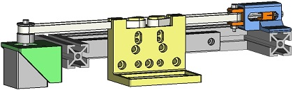
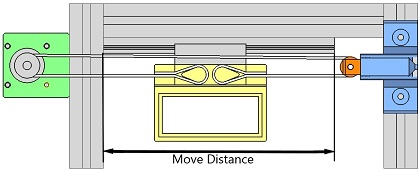
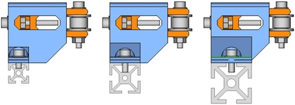
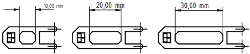
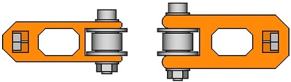
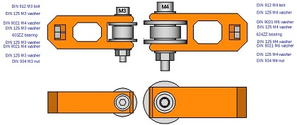

# Filter Stage
---
---
Este es el Workbench para la generación de la plataforma del filtro óptico.

- [Instalación](#instalaci%C3%B3n)
- [Funcionamiento del Workbench](#funcionamiento-del-workbench)
- [Trabajando en:](#trabajando-en)
---
## Instalación
Será necesario tener instalado el programa *FreeCAD* el cual se puede descargar desde [este enlace][dir]

[dir]: https://www.freecadweb.org/downloads.php

También será necesario descargar los archivos que se encuentran [aquí][dir2].

[dir2]: https://github.com/davidmubernal/Filter_Stage/tree/master/src

Para la instalación del Workbench deberemos acceder a la carpeta de instalación de *FreeCAD*. Por defecto sera:

	C:\Program Files\FreeCAD 0.17

Deberemos acceder a la carpeta *Mod* y dentro de esta **crear una carpeta**.  
Es importante que **el nombre de esta carpeta viene fijado dentro del archivo principal del Workbench llamado _InitGui.py_**.
Si el nombre de la carpeta es distinto al nombre que está especificado en el archivo no veremos el Workbench en *FreeCAD*.  
En este caso la carpeta se llamará **Filter_Stage**.

Tras crear la carpeta debemos introducir en ella los siguientes archivos principales del Workbench que hemos descargado anteriormente:

	Filter_StageGui.py
	Init.py
	InitGui.py

Estos tres archivos contienen el código para generar el Workbench.

También deberemos introducir los siguientes archivos necesarios para que funcione el *Workbench* que se encuentran en la carpeta *comps* dentro de la carpeta descargada inicialmente y son:

	beltcl.py
	comps.py
	fc_clss.py
	fcfun.py
  	filter_holder_clss.py
	kcomp.py
	kcomp-optic.py
	kpart.py
	partgroup.py
	parts.py
	partset.py
	shp_clss.py

Queda añadir las funciones dónde se genera la pieza y se encuentran [aquí][dirfun].
[dirfun]: https://github.com/davidmubernal/Filter_Stage/tree/master/src/func

	filter_stage_fun.py
	tensioner_clss.py

Una vez tengamos estos archivos en nuestra carpeta sólo queda crear una carpeta *icons* e introducir los [iconos][dir3] a la misma para poder ver en **FreeCAD** el Workbench.

[dir3]: https://github.com/davidmubernal/Filter_Stage/tree/master/icons

Si hemos seguido todos los pasos de manera correcta deberíamos tener en la carpeta Filter_Stage lo siguiente:

---
---
## Funcionamiento del Workbench
En este Workbench tendremos varios botones, cada uno con el fin de cumplir una finalidad.  
  
1. El primer botón realiza el filter stage según fue diseñado.
	

---
2. El segundo botón nos permite modificar las siguientes 5 variables:

  - Distancia de movimiento.  
		
  - Ancho de la base: limitado al tamaño del perfil de aluminio de 10mm, 15mm, 20mm, 30mm y 40mm  
		
  - Tensioner stroke.  
		
  - Espesor de la pared.  
		
  - Tipo de tuerca: limitado a las métricas M3, M4, M5 y M6  
  		  
  		

---
---
## Trabajando en:
Actualmente se trabaja en:
- *Botones adicionales para la realización de las piezas principales del proyecto*