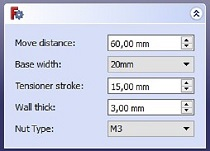
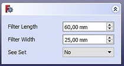
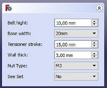
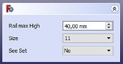

# Filter Stage
---
---
Select your lenguage:
- [English](#english)
- [Spanish](#español)

---
---
## English
This is the Workbench to do the stage of the optical filter.  

### Index  
- [Intall](install)  
- [How it's work](how-it's-work)  
- [Working on](working-on)  

#### Install
Before the installation of the workbench, it is necessary have installed FreeCAD.  You can download in [this page][dirFreeCADing]

[dirFreeCADing]: https://www.freecadweb.org/downloads.php

Also, we need to download the workbench files that we can find [here][dirFolder] 

[dirFolder]: https://github.com/davidmubernal/Filter_Stage/tree/master/src

For the installation of the workbench we need to go in the installation folder of FreeCAD. The default folder is:

	C:\Program Files\FreeCAD 0.17

We have to enter in the folder *Mod* and **make a new folder**.
**The name of the new folder is set in the main file of the workbench (InitGui.py)**.
If the name of the folder is not the set name the workbench will not show.  
In this case the name of the folder is **Filter_Stage**.

When the folder is made we need to bring in the folder the main files of the workbench that we had downloaded previously:

	Filter_StageGui.py
	Init.py
	InitGui.py
	
This three files have the code to generate the workbench.

Also, we need to bring in the folder the next files what makes the workbench work. These files are in the folder *comps* into the folder we have downloaded before.

	beltcl.py
	comps.py
	fc_clss.py
	fcfun.py
	kcomp.py
	kcomp-optic.py
	kpart.py
	partgroup.py
	parts.py
	partset.py
	shp_clss.py

It is necessary to add the functions where the piece is generated. These files are [here][dirFunction].

[dirFunction]:  https://github.com/davidmubernal/Filter_Stage/tree/master/src/func

	filter_holder_clss.py
    filter_stage_fun.py
	tensioner_clss.py

When these files are in the folder it is necessary to add the icons. To do that bring the folder *icons* in the folder Filter_Stage .

If all these steps was followed now we have something similar to this:

---
---
#### How it work
This workbench has some buttons  

---
1. The first button creates filter stage. The button enable setting values. If the values are not change, the button will create default filter stage.     
  

  - Move distance.    

  - Base width: is limited to the aluminum profile size (10mm, 15mm, 20mm, 30mm and 40mm).    

  - Tensioner stroke.  

  - Wall thickness.    

  - Nut type: limit to set metric (M3, M4, M5 and M6).  
  

2. The second button creates the Filter Holder. The button enable setting the followings values:
  

- Size of filter
- See linear guide (yes/no)

3. The third button creates the Tensioner. The button enable setting the followings values:
  

- Base width
- Tensioner high
- Tensioner stroke
- Wall thickness
- Nut type
- See bolts

4. The fouth button crates the Motor Holder. The button also anable setting:  
  

- Motor size  
- Max high of the rail  
- See motor or not  

5. The fifth button change the position of the object has been selected to the print position.
---
---
#### Working on
---
Currently working:
- *Last button can export files in .stl.*

---
---
## Español   
Este es el Workbench para la generación de la plataforma del filtro óptico.

### Índice
- [Instalación](#instalaci%C3%B3n)
- [Funcionamiento del Workbench](#funcionamiento-del-workbench)
- [Trabajando en](#trabajando-en)
---
#### Instalación
Será necesario tener instalado el programa *FreeCAD* el cual se puede descargar desde [este enlace][dirFreeCADesp]

[dirFreeCADesp]: https://www.freecadweb.org/downloads.php

También será necesario descargar los archivos que se encuentran [aquí][dirCarpeta].

[dirCarpeta]: https://github.com/davidmubernal/Filter_Stage/tree/master/src

Para la instalación del Workbench deberemos acceder a la carpeta de instalación de *FreeCAD*. Por defecto sera:

	C:\Program Files\FreeCAD 0.17

Deberemos acceder a la carpeta *Mod* y dentro de esta **crear una carpeta**.  
Es importante que **el nombre de esta carpeta viene fijado dentro del archivo principal del Workbench llamado _InitGui.py_**.
Si el nombre de la carpeta es distinto al nombre que está especificado en el archivo no veremos el Workbench en *FreeCAD*.  
En este caso la carpeta se llamará **Filter_Stage**.

Tras crear la carpeta debemos introducir en ella los siguientes archivos principales del Workbench que hemos descargado anteriormente:

	Filter_StageGui.py
	Init.py
	InitGui.py

Estos tres archivos contienen el código para generar el Workbench.

También deberemos introducir los siguientes archivos necesarios para que funcione el *Workbench* que se encuentran en la carpeta *comps* dentro de la carpeta descargada inicialmente y son:

	beltcl.py
	comps.py
	fc_clss.py
	fcfun.py
	kcomp.py
	kcomp-optic.py
	kpart.py
	partgroup.py
	parts.py
	partset.py
	shp_clss.py

Queda añadir las funciones dónde se genera la pieza y se encuentran [aquí][dirfun].

[dirfun]: https://github.com/davidmubernal/Filter_Stage/tree/master/src/func

	filter_holder_clss.py
    filter_stage_fun.py
	tensioner_clss.py

Una vez tengamos estos archivos en nuestra carpeta sólo queda crear una carpeta *icons* e introducir los [iconos][dir3] a la misma para poder ver en **FreeCAD** el Workbench.

[dir3]: https://github.com/davidmubernal/Filter_Stage/tree/master/icons

Si hemos seguido todos los pasos de manera correcta deberíamos tener en la carpeta Filter_Stage lo siguiente:

---
---
#### Funcionamiento del Workbench
En este Workbench tendremos varios botones, cada uno con el fin de cumplir una finalidad.  
  
  

1. El primer botón nos permite modificar 5 variables, si no se modifica ningún valor se realiza el filter stage como fue diseñado:  
  

  - Distancia de movimiento.  
  

  - Ancho de la base: limitado al perfil de aluminio (10mm, 15mm, 20mm, 30mm y 40mm).  
  

  - Tensioner stroke.  
  

  - Espesor de la pared.  
  

  - Tipo de tuerca: limitado a las métricas (M3, M4, M5 y M6).  
  
  

2. El segundo botón realizar el soporte del filtro y permite modificar las siguientes valirables:  
  

- Tamaño del filtro.  
- Ver guia lineal (Si/No).  

3. El tercer botón realiza el tensionador y nos permite modificar las siguientes variables:  
  

- Ancho de la base.  
- Altura del soporte del tensionador.  
- Tensioner stroke.  
- Esperos de la pared.  
- Tipo de tuerca.  
- Ver tornillos (Si/No).  

4. El cuarto botón realiza el soporte del motor permitiendo modificar:
  

- Tamaño del motor.
- Altura máxima del rail.
- Mostrar motor (Si/No).

5. El quinto botón modifica la posición del objeto seleccionado a su posición de impresión. 

---
---
#### Trabajando en
Actualmente se trabaja en:
- *Exportar objeto en .stl al pulsar el último botón.*