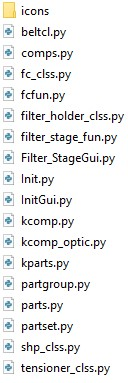

# Filter_Stage
## Instalación
Será necesario tener instalado el programa *FreeCAD*, se puede descargar en todos los sistemas operativos seleccionando el tuyo desde [este enlace][dir]

[dir]: https://www.freecadweb.org/downloads.php

Para la instalación del Workbench deberemos acceder a la carpeta de instalación de *FreeCAD*. Por defecto sera:

	C:\Program Files\FreeCAD 0.17

Para la instalación de este *Workbench* tendremos que descargar los archivos necesarios. Estos archivos se encuentran [aquí][dir2].

Deberemos acceder a la carpeta *Mod* y dentro de esta **crear una carpeta**. 
En este caso la carpeta se llamará **Filter_Stage**.
Es importante que **el nombre de esta carpeta viene fijado por los archivos principales del Workbench**.
Si el nombre de la carpeta es distinto al nombre de los archivos no veremos el Workbench en *FreeCAD*.

Tras crear la carpeta debemos introducir los siguientes archivos principales del Workbench:

[dir2]: http://www.github.com/davidmubernal/Filter_Stage/src

	filter_stage_fun.py
	Filter_StageGui.py
	Init.py
	InitGui.py

Estos tres archivos contienen el código para generar el Workbench.

Ahora deberemos introducir los archivos necesarios para ejecutar el workbench. Para ello
debemos mirar los *import* de los archivos.
En *Filter_StageGui.py* se realiza el *import* de *filter_stage_fun.py*, por tanto
debemos añadir a nuestra carpeta dicho archivo.

Si abrimos *filter_stage_fun.py* veremos nuevos *imports*. Estos archivos se encuentran en la 
carpeta *comps* y son:

	beltcl.py
	comps.py
	fc_clss.py
	fcfun.py
  	filter_holder_clss.py
	kcomp.py
	kcomp-optic.py
	kpart.py
	partgroup.py
	parts.py
	partset.py
	shp_clss.py
	tensioner_clss.py

Una vez tengamos estos archivos en nuestra carpeta sólo queda añadir la carpeta *icons* a la misma para poder ver en **FreeCAD** el Workbench.

Si hemos seguido todos los pasos de manera correcta deberíamos tener en la carpeta Filter_Stage lo siguiente:

## Funcionamiento del Workbench
En este Workbench tendremos varios botones, cada uno con el fin de cumplir una finalidad.
- El primer botón realiza el filter stage según se diseño.
  
- El segundo botón nos permite modificar las siguientes 5 variables:
  
  - Tipo de rosca: limitado al conjunto de roscas definidas en el programa.
  - Altura de la correa.
  - Tensioner stroke.
  - Ancho de la basa: limitado al tamaño del perfil de aluminio definido en el programa.
  - Espesor de la pared.
El *tipo de rosca* está limitado al conjunto de roscas definidas en el programa.

## Trabajando en:
Actualmente se trabrabaja en:
- *Botones adicionales para la realización de las piezas principales del proyecto*
- *Nuevos iconos para los botones actuales*
- *Mejora del segundo botón limitando las opciones de las roscas a las definidas*
